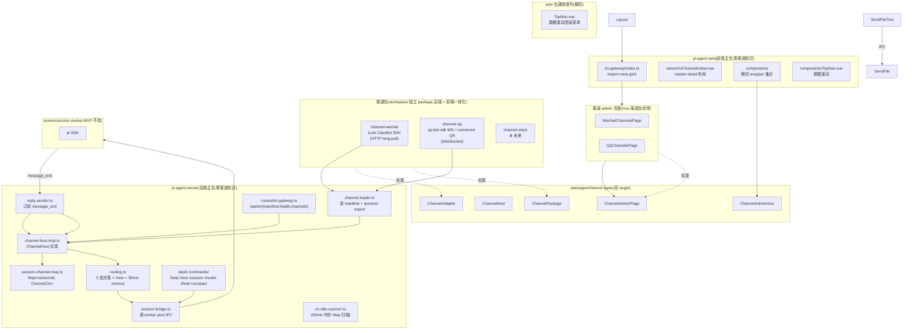

# pi-agent-server im-gateway

> IM 网关模块架构。允许用户通过 QQ / 微信等 IM 平台跟 agent 对话。
> 状态:**架构设计定稿,实施中**(openspec change `im-gateway`)。

## 系统全景图



## 核心思想

IM 网关是 **pi-agent-server 进程内模块**,但代码组织上完全 workspace package 化。每个渠道是独立的 npm package,主包(后端 + 前端)零 import 渠道实现,只通过 `channel-types` 共享包里的 5 个接口通信。

**关键约束**:
- **后端 + 前端共用一份 manifest**(`platform/channels/manifest.json`),加新渠道 = 加目录 + manifest 加一行,主包零改
- **每个渠道包同时提供后端 adapter + 前端 admin 页面**(前后端一体)
- **5 个接口调用方向严格区分**,无循环依赖(主包↔渠道包的"调用/被调用"关系清晰)
- **横切关注(鉴权/token/i18n)在主包 wrapper**,子页面/子工具零感知
- **SDK 依赖归渠道包**,主包 package.json 不添加任何 IM SDK

## 5 个核心接口(调用方向严格区分)

```
主包(server) ──调──> ChannelAdapter       ←──实现── 渠道包(后端)
渠道包(后端) ──调──> ChannelHost          ←──实现── 主包(server)
主包(web) ──调──> ChannelAdminPage       ←──实现── 渠道包(前端)
渠道包(前端) ──调──> ChannelAdminHost    ←──实现── 主包(web)
渠道包(后端) export default ChannelPackage ←─import─ 主包(server)
```

物理位置:5 个接口都在 `platform/packages/channel-types/` 共享包(双 target:Node + DOM)。

## 加载机制(后端 vs 前端不对称)

| 层面 | 机制 | 原因 |
|---|---|---|
| 后端(server) | `await import("@pi-agent-platform/${pkgName}")`(Node 运行时真动态) | Node runtime 支持 |
| 前端(web) | `import.meta.glob("/channels/*/src/admin/index.ts")`(Vite 静态扫描)+ manifest 运行时过滤 | Rollup 构建期无法静态分析模板字符串 import |

后端 + 前端**共用同一份** `platform/channels/manifest.json`。

## 数据模型(三张表 + 渠道自管 DDL)

| 表 | 归属 | 创建方式 |
|---|---|---|
| `agents` | 主包(server) | `db/init.ts` 初始化 |
| `sessions` | 主包(server) | `db/init.ts` 初始化;新增 `source TEXT` 字段标记来源(web/ide/im) |
| `channels_wechat` | 微信渠道包 | 渠道包 `register()` 时 `host.executeMigration('wechat_channels_v1', sql)` |
| `channels_qq` | QQ 渠道包 | 渠道包 `register()` 时 `host.executeMigration('qq_channels_v1', sql)` |
| `channels_qq_routes` | QQ 渠道包 | 同上 |

**主包零渠道 DDL**:主包 `db/init.ts` 只写主表 DDL,IM 渠道表完全由渠道包 register 时声明。

## HTTP API(23 条 = 主包 5 + 微信 9 + QQ 9)

```
主包汇总(5 条):
  GET  /api/im/manifest          ← 启用渠道列表(给前端)
  GET  /api/im/health            ← 渠道包加载状态 + adapter 连接状态
  GET  /api/im/channels          ← 跨 type channels 只读列表
  GET  /api/im/debug/state       ← dev-only:内部状态快照(session map + adapters + QQ notified)
  GET  /api/im/events            ← SSE:渠道日志实时流(dev+prod 都挂,admin 实时事件用)

微信渠道(9 条,渠道包自挂 /api/im/wechat/*):
  GET    /channels               ← 列出
  POST   /channels               ← 创建
  GET    /channels/:id           ← 详情
  PATCH  /channels/:id           ← 修改
  DELETE /channels/:id           ← 删除
  POST   /qr-login               ← 创建 row + auto storageDir + 返回 channelId(不启动)
  POST   /channels/:id/start-qr  ← 触发 SDK 扫码登录,经 SSE 推 qr-url / connected
  POST   /channels/:id/start     ← 启动(复用 stored creds,失败 fallback 到 QR)
  POST   /channels/:id/stop      ← 停止

QQ 渠道(9 条,与微信同模板,渠道包自挂 /api/im/qq/*):
  GET    /channels, POST /channels, GET /channels/:id, PATCH /channels/:id, DELETE /channels/:id
  POST   /qr-login               ← 后续由 connector onCredentials 回调回填 appId/appSecret
  POST   /channels/:id/start-qr  ← 启动 QR 流
  POST   /channels/:id/start     ← 启动(已有 credentials)
  POST   /channels/:id/stop      ← 停止
```

> **MVP 简化**:**bindings 4 条路由 MVP 不暴露**(群聊 / per-chat binding 推迟到下个 change)。QQ 渠道 MVP 只走"单 channel 单 agent"模式(用 `defaultAgentId`),不暴露 bindings 子表路由。完整 11+ 条在群聊支持时再加。

> **斜杠命令变更**(2026-09-16):`POST /:id/command` 现在调 `runBuiltinCommand()`(统一入口),命令名对齐 IM 端(`think` 替代 `thinking`,保留 alias)。新增 `name`、`hotkeys` 命令。

## sendFileToUser 工具(MVP 跳过,推下个 change)

MVP **不实现** `sendFileToUser` 工具。完整设计文档保留在 v2 git history,实施时按 `specs/send-file-to-user/spec.md`(v1)和设计文档实现。

**MVP 期间**:
- agent 通过工具发文件/图片不支持(MVP 期间用户手动复制文件)
- `ChannelAdapter.sendImage` / `sendFile` 已定义,MVP 期间不通过工具暴露
- worker 包**不动**(无需 `WorkerMethod` 扩展 / dispatcher case / `customTools` 注入)

## reply-sender(消息回复机制)

worker 端 `agent_end` event 不含回复文本(`delta` 是空 sentinel),实际文本在 `message_end`。reply-sender:
1. **累积**`message_update` 事件(按 messageId 缓存)
2. **触发**`message_end` 时取最终文本
3. **关联**用 `messageId.parentId` 关联到 user prompt,保证多消息排队时回复顺序正确

## 附件管道(adapter → store → prompt-resolver → worker)

### 数据流
```
adapter 收到文件
  → host.uploadAttachment(sessionId, bytes, mime, filename)
  → attachmentStore.upsert → 写磁盘(uuid.ext) + INSERT DB(id, sha, filename)
  → 返回 att_id
  → adapter 拼 [pi-attachment:att_xxx] 到文本
  → routing.ts → resolvePrompt(sessionId, text)
    → 正则匹配 [pi-attachment:att_xxx]
    → attachmentStore.lookupForPrompt(sessionId, ids)
    → 返回 { path, mimeType, originalFilename }
  → worker:
    ├── isImageMimeType → base64 (resizeImage 管线)
    └── 非图片 → <file path="..." name="原始文件名" type="mimeType"></file>
```

### attachment-store
- **存储布局**: `~/.pi-agent-server/attachments/<sessionId>/<uuid>.<ext>`
- **文件名**: UUID 格式（`uuid.ext`），不使用 SHA（太长）
- **内容寻址**: SHA-256 用于 dedup（同 session 同 sha 不重复写入）
- **MIME 白名单**: 已移除，支持所有文件类型
- **附件 ID**: `att_<uuid-no-dashes-12chars>`（如 `att_452a8fcc9e32`）
- **DB 新增列**: `filename TEXT NOT NULL DEFAULT ''`（存磁盘文件名）

### prompt-resolver.ts（独立模块）
统一处理：斜杠命令检查 → `[pi-attachment:att_xxx]` 占位符解析 → agent config 加载 → streamingBehavior 判断。HTTP 和 IM 两端都调它。

### worker 分流
- 图片（png/jpeg/gif/webp）→ `resizeImage` → base64 → multimodal
- 非图片 → `<file path name type></file>` → agent 用 read 工具读取

## IM session idle timeout(30 分钟,内存实现)

现有 `session-timeout-scanner` 只杀 placeholder,active session 永不回收 — IM 场景会占满 `maxWorkers`。新增规则:
- IM 网关自己维护 `Map<sessionId, SessionMeta>`,内容 `{ agentId, channelId, chatId, lastActiveAt }`
- 定时扫描(每分钟一次),`Date.now() - lastActiveAt > 30 * 60 * 1000` → kill worker(reason='im-idle-timeout')
- sessions row 保留(status='active'),下次消息触发自然 respawn
- 下次消息触发自然 respawn(`spawnAndCreate` 已支持按 `pi_session_path` 恢复)
- web / IDE session 不适用此规则(走原 placeholder timeout + LRU 驱逐)

## 重启会话恢复（State B2 fallback）

`session-channel-map` 是内存 Map，重启即丢失。`channels_qq.current_session_id` 存了 sessionId 但没存 chatId，`seedSessionFromConfig` 传 chatId=undefined 导致 map key 不匹配（`channelId+''` vs `channelId+openId`）。

**解决方案**：`ensureSession`（routing.ts 版本）加 State B2 fallback：
```
ensureSession(channelId, chatId):
  A. map 命中 + worker 活着 → 复用
  B. map 命中 + worker 死了 → respawn
  B2. map 没命中 + cfg.currentSessionId 有值 + session 存在 → respawn + 绑定当前 chatId  ← 新增
  C. 都不满足 → 创建新 session
```

**假设**：一个 bot 对一个用户（私聊场景）。多用户场景需重新设计（加 chatId 列或独立映射表）。

## 关键决策

| # | 决策 | 选择 |
|---|---|---|
| D1 | 进程位置 | 进程内模块,workspace package 化(渠道独立) |
| D2 | 跟 worker 通信 | 直接调 IPC,不套 HTTP |
| D3 | 数据库 | 共用 SQLite,渠道表自管 DDL,主包零渠道 SQL |
| D4 | 接口设计 | 5 个接口,调用方向严格区分 |
| D5 | 群路由 key | 用 `chat_id`(防 OpenClaw #10207 bug),不用 sender user id |
| D6 | session 状态字段 | 放渠道表(`current_session_id`),不建独立映射表 |
| D7 | sendFileToUser | worker 薄壳 + master 统一处理,闭包捕获 sessionId |
| D8 | 渠道指令注入 | adapter 实现 `getSystemPromptContext(channelId, chatId)` 但路由层 **⏸️ MVP 未消费**(返回值未注入 `RuntimeConfig.appendSystemPrompt`)|
| D9 | 斜杠命令分发 | gateway 层解析(builtin → worker 二级分发);**⏸️ per-route 自定义 MVP 未落地** |
| D10 | 路由未命中 | 返回错误消息,不自动 binding |
| D11 | HTTP API 路径 | 主包汇总 + 渠道包自挂(`/api/im/<type>/*`) |
| D12 | 依赖归属 | SDK 归渠道包,主包零 SDK |
| D13 | adapter 重连 | adapter 内部指数退避,1s → 5min |
| D14 | manifest 加载 | server dynamic import + web `import.meta.glob` |
| D15 | web 加载机制 | `import.meta.glob`(不用模板字符串 import) |
| D16 | IM session timeout | 30 分钟,内存 Map,kill worker 留 row |
| D17 | web 顶部菜单 | Agents / Sessions / QQ / WeChat Channel,数据驱动(meta.navLabel) |
| D18 | prompt-resolver 位置 | 独立文件,不塞 session-bridge |
| D19 | adapter 附件处理 | adapter 下载 + host.uploadAttachment + 占位符 |
| D20 | attachment MIME | 移除白名单,支持所有类型 |
| D21 | 非图片附件呈现 | `<file path>` 标签,agent 主动 read |
| D22 | attachment ID 格式 | `att_<uuid-12hex>` |
| D23 | 磁盘文件名 | UUID 格式(`uuid.ext`) |
| D24 | 重启会话恢复 | ensureSession B2 fallback: cfg.currentSessionId → respawn |
| D25 | QQ 原始文件名 | 用 QQ API 的 `att.filename` 字段 |

完整决策见 `openspec/changes/im-gateway/design.md`(955 行,16 个 D)。

## 子模块架构索引(指向 openspec specs/)

IM 网关的子能力**不另写架构文档**,通过 OpenSpec specs 维护:

| Capability | Spec |
|---|---|
| 整体框架 + manifest 加载 | [`specs/im-gateway-overview/`](../../openspec/changes/im-gateway/specs/im-gateway-overview/spec.md) |
| 5 个共享接口 | [`specs/channel-types-package/`](../../openspec/changes/im-gateway/specs/channel-types-package/spec.md) |
| ChannelAdapter 实现规范 | [`specs/im-gateway-channel-adapter/`](../../openspec/changes/im-gateway/specs/im-gateway-channel-adapter/spec.md) |
| worker pool 桥接 | [`specs/im-gateway-session-bridge/`](../../openspec/changes/im-gateway/specs/im-gateway-session-bridge/spec.md) |
| 路由 + 三态 + /new | [`specs/im-gateway-routing-policy/`](../../openspec/changes/im-gateway/specs/im-gateway-routing-policy/spec.md) |
| 微信渠道实现 | [`specs/wechat-channel/`](../../openspec/changes/im-gateway/specs/wechat-channel/spec.md) |
| QQ 渠道实现 | [`specs/qq-channel/`](../../openspec/changes/im-gateway/specs/qq-channel/spec.md) |
| (sendFileToUser 工具) | **MVP 跳过,下个 change**(完整设计保留在 git history) |
| 渠道指令注入 | [`specs/channel-system-prompt-injection/`](../../openspec/changes/im-gateway/specs/channel-system-prompt-injection/spec.md) |
| 斜杠命令 | [`specs/chat-slash-commands/`](../../openspec/changes/im-gateway/specs/chat-slash-commands/spec.md) |
| Web 管理 UI | [`specs/im-gateway-admin-ui/`](../../openspec/changes/im-gateway/specs/im-gateway-admin-ui/spec.md) |

## 待决项

| 项 | 状态 | 说明 |
|---|---|---|
| `/bind` slash command | ⏸️ 留位置,未实现 | 当前未命中路由返回错误消息 + 提示用 /bind,MVP 管理员手动通过 API 加 binding |
| typing indicator | ⏸️ 不做 | QQ / 微信 iLink 都支持,但 MVP 不调 |
| 主动推送 | ⏸️ 不做 | 微信 iLink 协议限制 |
| 微信群聊 | ⏸️ 不做 | iLink 协议尚未开放 |
| 群消息队列 | ⏸️ 不做 | 非触发消息直接丢弃 |
| 鉴权 | ⏸️ 上线前必补 | 当前裸奔,跟 server 现有状态一致 |
| 限流 | ⏸️ 不做 | 后续加 middleware |
| 多 agent 路由(同一 channel 多 chat 不同 agent) | ⏸️ 不做 | 当前单 channel 一 agent(微信)或 per-chat binding(QQ) |
| 渠道指令注入(D8) | ⏸️ adapter 接口已实装 | `getSystemPromptContext` 返回值未注入到任何 prompt |
| per-route 自定义斜杠命令(D9) | ⏸️ MVP 未落地 | 当前仅 builtin → worker 二级分发 |
| `qq-bot-sdk` AGPL-3.0 商用评估 | ⏸️ 待办 | ChannelAdapter 抽象允许替换 |
| `@wechatbot/wechatbot` 成熟度验证 | ⏸️ 待办 | 新包,需早期 spike |

## 相关决策

- [`doc/architecture/current/pi-agent-server_overview.md`](pi-agent-server_overview.md) — IM 渠道从"⏸️ 待实现"升级为"✅ 已设计,实施中"
- [`doc/architecture/current/pi-agent-server_worker-pool.md`](pi-agent-server_worker-pool.md) — worker pool 调度(IM session idle timeout 影响 placeholder 驱逐)
- [`doc/architecture/current/pi-agent-server_session-lifecycle.md`](pi-agent-server_session-lifecycle.md) — session 状态机扩展 IM idle timeout 规则
- [`doc/architecture/current/pi-agent-server_db-schema.md`](pi-agent-server_db-schema.md) - 渠道表归渠道包(2 张,sessions.source 字段推迟)
- [`doc/architecture/current/pi-agent-server_invariants.md`](pi-agent-server_invariants.md) — 待补充"主包零渠道知识"硬约束
- [`openspec/changes/im-gateway/proposal.md`](../../openspec/changes/im-gateway/proposal.md) — 提案(163 行)
- [`openspec/changes/im-gateway/design.md`](../../openspec/changes/im-gateway/design.md) — 设计(955 行,16 个 D)
- [`openspec/changes/im-gateway/tasks.md`](../../openspec/changes/im-gateway/tasks.md) — 实施任务(65 个)
- [`openspec/changes/im-gateway/notes/im-gateway-research.md`](../../openspec/changes/im-gateway/notes/im-gateway-research.md) — 调研笔记
