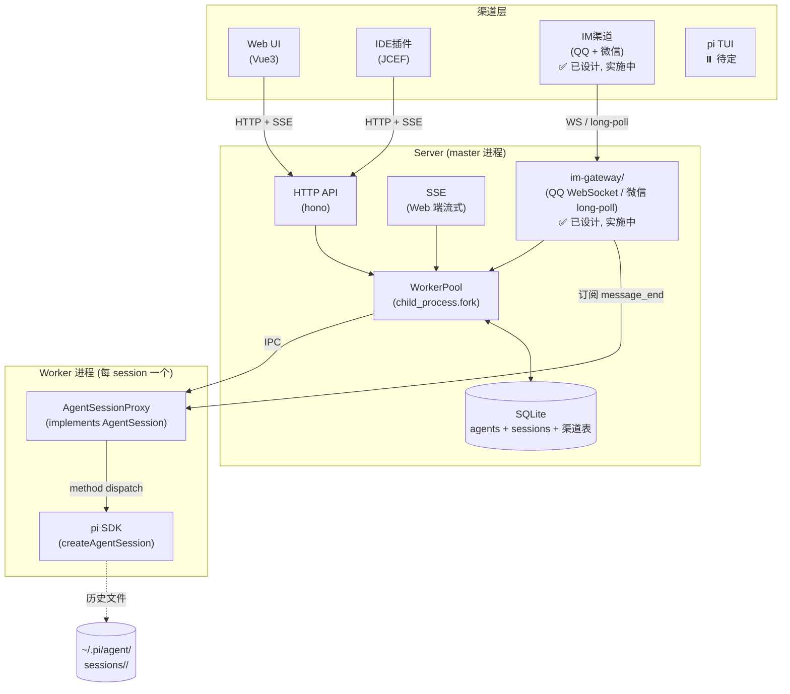

# pi-agent-server overview

> pi-agent-server 子项目的架构入口。

## 系统全景图

## 核心思想

Server 是一个 Node.js 进程（master），负责 HTTP API、DB 持久化、worker pool 管理。每个 session 对应一个 worker 子进程，worker 内通过 pi SDK（`createAgentSession()`）运行 agent。Master 通过 `AgentSessionProxy`（implements pi SDK 的 `AgentSession` 接口）跟 worker 通信，代码层面看起来像直接调 SDK，不引入自定义协议概念。

**关键约束**：
- 协议所有权在自己（master ↔ worker），不在 pi
- 100% 能力暴露（worker 包装 SDK，可以扩展）
- pi 升级不影响 master（隔离在 worker 内）

## 渠道接入

| 渠道 | 接入 | 说明 |
|---|---|---|
| Web | HTTP + SSE | ✅ MVP |
| IDE (JCEF) | HTTP + SSE | ✅ MVP |
| **IM (QQ + 微信)** | **渠道包:QQ WebSocket + 微信 iLink HTTP long-poll** | ✅ **设计定稿,实施中(详见 `pi-agent-server_im-gateway.md`)** |
| pi TUI | 待定 | ⏸️ 暂未集成 |

## 子模块架构索引

| 子模块 | 文档 | 状态 |
|---|---|---|
| worker-pool | [`pi-agent-server_worker-pool.md`](pi-agent-server_worker-pool.md) | ✅ 已写 |
| ipc | [`pi-agent-server_ipc.md`](pi-agent-server_ipc.md) | ✅ 已写 |
| session-lifecycle | [`pi-agent-server_session-lifecycle.md`](pi-agent-server_session-lifecycle.md) | ✅ 已写 |
| db-schema | [`pi-agent-server_db-schema.md`](pi-agent-server_db-schema.md) | ✅ 已写 |
| http-api | [`pi-agent-server_http-api.md`](pi-agent-server_http-api.md) | ✅ 已写 |
| **im-gateway** | **[`pi-agent-server_im-gateway.md`](pi-agent-server_im-gateway.md)** | ✅ **设计定稿,实施中** |
| **debug-testing** | **[`pi-agent-server_debug-testing.md`](pi-agent-server_debug-testing.md)** | ✅ **已写规范**（unit tests 替代品 — dev-only debug 端点 + curl 验证） |

## 待决项

| 项 | 状态 |
|---|---|
| worker 数量策略（固定 / 动态 / 无限制）| ⏸️ 暂不定 |
| worker 崩溃重启策略 | ⏸️ 未讨论 |
| worker 日志聚合 | ⏸️ 未讨论 |
| session 超时配置粒度 | ⏸️ 未讨论 |
| pi TUI 接入方式 | ⏸️ 待定 |
| IM 渠道(微信 iOS 限制 / qq-bot-sdk AGPL)| ⏸️ 见 `pi-agent-server_im-gateway.md` 待决项 |

## 相关决策

- [决策 20](../../../personal-agent-manage/doc/decisions/20-server-sdk-orchestrator-with-worker-pool.md) —— 架构决策来源（**仅参考，不迁移**）