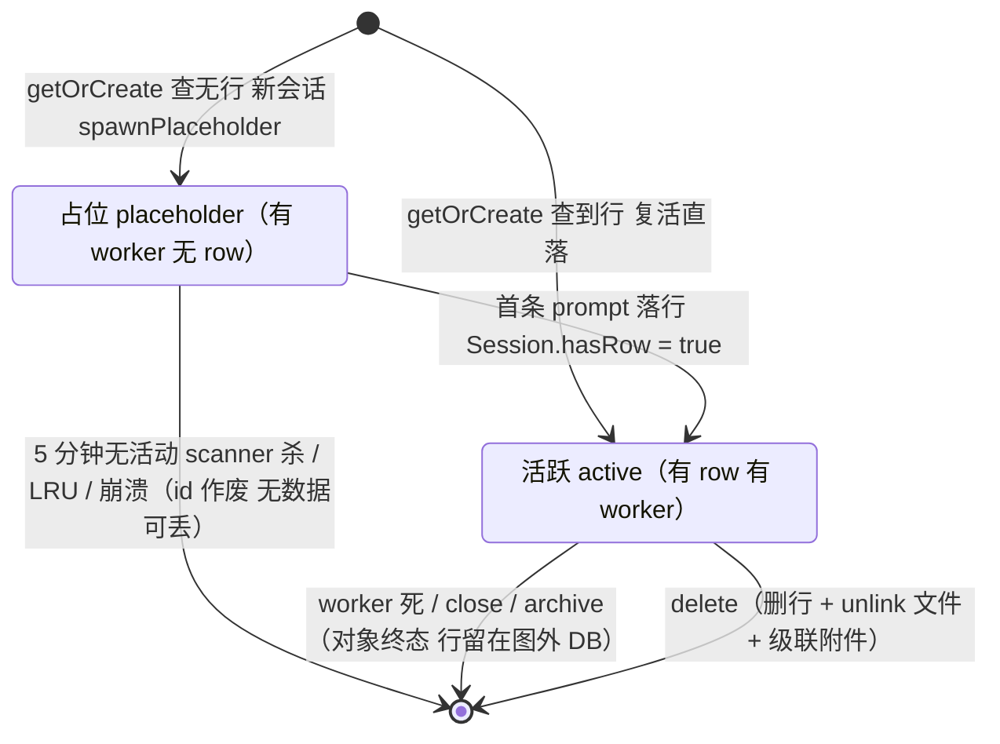
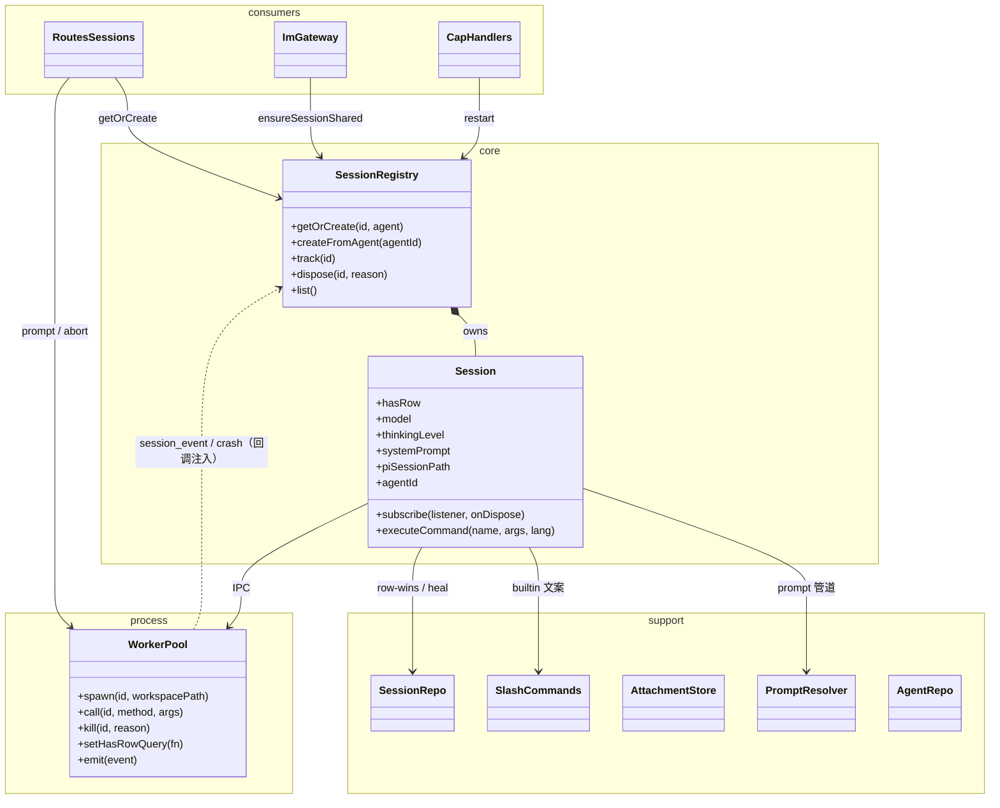

# pi-agent-server session-lifecycle

> Session 生命周期。定义 session 何时创建、销毁、配置管理。
> v2：placeholder 即 spawn + 统一 context 端点 + worker pool 上限 20 + LRU + 删 active 自动超时。
> **服务层**：spawn/复活唯一入口 = `services/session.ts` 的 `SessionRegistry`（getOrCreate / createFromAgent）；领域状态归 `Session` 对象。

## 状态机



事件注解：

- `POST /api/sessions/agents/:agentId` → 生成 sessionId + spawn worker + `listCommands`/`listAvailableModels`（**sessions 表未写**）；客户端拿到 `{ sessionId, commands[], models[] }`
- `POST /api/sessions/:id/prompt` → `sessionRegistry().getOrCreate` → INSERT sessions + `Session.hasRow = true`
- `POST /:id/close` → kill worker，**row 保留、DB 不改 status**；`active` **不会自动超时**（scanner 只杀无行者）
- 重建：用户消息到达 → `getOrCreate` 从 `[*]` 重进有行分支（复用 `piSessionPath` 读盘）

**关键变化**（vs v1）：
- **占位不是无状态过渡**——worker 已经 spawn，可以即时提供 commands/models
- **`status='archived'` 字段不再被自动写**——worker pool 是 session alive 的 source of truth
- **active session 不自动超时**——生命周期完全由调用方管理（IDE 关 tab / Web 手动接口）

## Session 领域对象（services/session.ts）

`Session` 是一个 session id 的**领域对象**，拥有全部领域状态：

```typescript
class Session {
  id: string;
  hasRow: boolean;          // placeholder vs active（LRU / 超时扫描的判据）
  model / thinkingLevel;    // worker 实时值缓存（/:id/context 读）
  sessionName;              // pi 原生名（heal 输入）
  systemPrompt;             // createSession 后缓存（免 10K 字符 IPC 重取）
  piSessionPath;            // 复活时读历史
  agentId;                  // 无 row 的 placeholder 归属（授权 ctx 解析）
  subscribe(listener, onDispose);  // 事件订阅（pool session_event 转发）
  executeCommand(name, args, lang); // 会话级斜杠命令（model/think/compact/name/session/hotkeys）
}
```

`SessionRegistry`（同文件，module singleton，`initSessionRegistry()` 在 main() 装配）：

- **`getOrCreate(id, agent)`**—— spawn/复活唯一入口。内存命中（对象活 + 有 row）直接返回；否则行感知调私有 `spawnAndCreate`。并发首次调用共享同一 inflight promise（幂等），失败不缓存
- **`createFromAgent(agentId)`** —— 新 id + placeholder spawn，**不写 row**（HTTP 两阶段第 1 阶段；失败自清 partial worker）
- **`track(id)`** —— 拿一个**无 worker** 的对象锚点（SSE 订阅 / 只读 repo 命令用；绝不 spawn，最后一个订阅者离开时自动释放）
- **`dispose(id, reason)`** —— 终态：通知并清空订阅者 + 移出 registry。pool 的 `'crash'` 事件（任何 exit）自动触发

**对象生命周期 = worker 生命周期**：对象在 spawn 前创建、worker 死时 dispose；对象从不跨 worker 死亡（持久身份在 DB 行）。`spawnPlaceholder` / `spawnAndCreate` 是本文件模块私有实现——**外部代码不得绕过 registry 直接 spawn**。

依赖方向（四层单向；详细铁律见 [invariants](pi-agent-server_invariants.md)）：



- **消费层只碰 `Session` + `SessionRegistry`**；prompt-resolver / slash-commands / attachment-store 是 Session 背后的支撑细节
- `session-channel-map`（渠道↔会话绑定）**留在 im-gateway**——Registry 不长渠道知识，消费方持 sessionId 值不持对象

## 创建：两阶段

### 阶段 1：占位（生成 sessionId + spawn worker，不写表）

```typescript
// POST /api/sessions/agents/:agentId
async function createPlaceholder(agentId: string): Promise<PlaceholderSessionResponse> {
  const agent = agentRepo.getOrThrow(agentId);
  if (!existsSync(agent.workspacePath)) throw 400;

  const session = await sessionRegistry().createFromAgent(agentId);  // 生成 id + spawn，不写表
  const [commands, models] = await Promise.all([
    workerPool.call<SlashCommandDTO[]>(session.id, 'listCommands', []),
    workerPool.call<ModelInfo[]>(session.id, 'listAvailableModels', []),
  ]);
  return { sessionId: session.id, agentId, commands, models };
}
```

**为什么占位也 spawn worker**：
- 用户开 tab 后 slash menu 立即可用（看到 `.pi/prompts/*.md`、`.pi/skills/*/SKILL.md`、extension commands）
- 用户从模型下拉选 model 时看到完整列表
- **代价**：每次开 tab 触发 `createAgentSession`（读 models.json + 扫 cwd `.pi/` + 加载 packages）—— 一般 < 200ms

### 阶段 2：实际创建（第一条 prompt 时写 sessions 表）

```typescript
// POST /api/sessions/:id/prompt
async function handlePrompt(sessionId: string, message: string, body: PromptRequest) {
  const agent = agentRepo.getOrThrow(body.agentId);
  const existing = sessionRepo.get(sessionId);

  if (existing) {
    // archived 复活 / 重启后回到 active（内部：内存命中检查 + 并发 inflight 去重）
    await sessionRegistry().getOrCreate(sessionId, agent);
    sessionRepo.update(sessionId, {});  // bump lastActiveAt
  } else {
    // 占位 + worker 已存在（被 POST /agents/:agentId 创建）→ 复用 worker + 写 row
    await sessionRegistry().getOrCreate(sessionId, agent);
  }

  await workerPool.call(sessionId, 'prompt', [message, body.images, body.streamingBehavior]);
  sessionRepo.update(sessionId, {});

  // send() 完成后 Vue 端 loadContext() 拿 hasRow=true 的 session field
}
```

**私有 `spawnAndCreate` 关键职责**（registry.getOrCreate 内部）：
- `workerPool.spawn(sessionId, workspacePath)`（LRU 可能在 spawn 内部触发）
- `workerPool.call(sessionId, 'createSession', [runtimeConfig, sessionId, existingSessionPath])`
- 写/更新 `sessions` 表（`createFromAgent` or `update({model})`）
- **`session.hasRow = true`**——从 placeholder 变 active（`hasRow` 是 Session 字段，不再是 WorkerEntry / markRowWritten）
- **`cacheSystemPrompt(session, workerPool)`**—— fetch `getSystemPrompt` IPC、缓存到 **Session 对象**，让 `GET /:id/context` 能返回完整 systemPrompt 文本
- **`healPiSessionName(...)`（title 同步）** —— 比对 `createSession` 返回的 `sessionName` 与 `row.title`：相等（含双方空）跳过、不等 DB 优先调 `setSessionName` 收敛 pi 侧（冲突记 info 日志）；placeholder 路径（无 row）不比对。见下方“Session title 双向同步”。

**私有 `spawnPlaceholder` 关键职责**（`createFromAgent` 内部，同路径独立调）：
- `workerPool.spawn(sessionId, workspacePath)`
- `workerPool.call(sessionId, 'createSession', [...])`
- 缓存 `piSessionPath` / `model` / `thinkingLevel` / `sessionName` / `systemPrompt` 到 **Session 对象**
- **不写** `hasRow`（保持 false）

### systemPrompt 拼接职责（2026-08-30+）

**Worker 不再 100% 依赖 pi SDK 拼接 systemPrompt**。createSession 之后，如果 `config.systemPrompt` 非空，worker 用 `_systemPromptOverride` 接管拼接：

```
[worker createSession]
  ↓
[pi SDK buildSystemPrompt({ customPrompt: agent.systemPrompt })]
  ↓ customPrompt 分支返回 prompt_A (default-build)
[worker 检查 config.systemPrompt?.trim()]
  ↓ 非空
[拼接 prompt_B = userPrompt + suffix]
  suffix 顺序: Available tools → "In addition to..." → tool promptGuidelines
             → appendSection → <project_context> → <available_skills> → cwd
[realSession._systemPromptOverride = prompt_B]
  ↓
[每次 LLM 调用: this._systemPromptOverride ?? this._baseSystemPrompt → prompt_B]
```

- customPrompt 路径：保留 Available tools / "In addition to..." / tool promptGuidelines（避免 model 乱调用工具）
- default 路径：走 pi SDK 原 default prompt（含 Pi doc / Role def / 硬编码 Guidelines），不动
- 详细规格见 [changelog 013：worker 接管 systemPrompt](../changelog/2026-08-30_013-worker-system-prompt-takeover.md)

**单实现（2026-09-30 起）**：`spawnPlaceholder` / `spawnAndCreate` 只有 `services/session.ts` 一份实现，且为**模块私有**——routes / capabilities / IM 网关一律经 `sessionRegistry()` 调用。改 systemPrompt 拼接或 cacheSystemPrompt 只改这一处，全部渠道（HTTP/IM）同时生效。依赖铁律：**核心代码不得 import im-gateway**（session-bridge 时代的反向依赖已清零）。

**两种场景走同一路径**：
- 占位 sessionId + 第一条 prompt → INSERT + `session.hasRow = true`
- archived session + 用户消息 → 已存在 + worker 死 → 重建（复用 piSessionPath）

## 销毁：调用方管理

```typescript
// 用户关 tab（IDE 端）
async function closeSession(sessionId: string) {
  if (workerPool.has(sessionId)) {
    await workerPool.kill(sessionId, 'tab-closed');
  }
  // NOTE: session row 保留在 DB（status='active'），用户可以从历史重开
}

// 用户主动归档（web 端或 IDE）
async function archiveSession(sessionId: string) {
  if (workerPool.has(sessionId)) await workerPool.kill(sessionId, 'archive');
  sessionRepo.archive(sessionId);  // status='archived'（手动 API 才写）
}

// scanner: placeholder 超时自动清理
async function scanPlaceholderTimeouts() {
  const now = Date.now();
  for (const entry of workerPool.list()) {  // snapshot 避免迭代中修改
    // list().hasRow 由注入的 hasRowQuery 提供（回源 Session.hasRow）
    if (!entry.hasRow && (now - entry.spawnTime) > config.placeholderTimeoutMs) {
      await workerPool.kill(entry.sessionId, 'placeholder-timeout');
    }
  }
}
```

**触发销毁的场景**：
- **Placeholder 5 分钟无活动**（默认 `PLACEHOLDER_TIMEOUT_MINUTES=5`）—— scanner 自动清理
- **用户/IDE 关 tab** → `POST /:id/close` 立即杀 worker
- **用户主动归档** → `POST /:id/archive` + DB status='archived'
- **Master 退出** → OS 自动 kill worker 子进程
- ~~**Active session 超时**~~ —— **已删除**（OQ-D2 演化）

## 配置管理：完全快照

**创建时**：INSERT sessions，从 agent 表**完整复制**配置字段到 sessions 对应字段。

**session 内修改**：更新 sessions 对应字段（**不写回** agent 表）。

```typescript
async function setSessionModel(sessionId: string, provider: string, modelId: string) {
  await workerPool.call(sessionId, 'setModel', [provider, modelId]);
  sessionRepo.update(sessionId, { model: `${provider}/${modelId}` });
}
```

**session 恢复**：完全读 sessions 表，**不读 agent 表**。

**恢复的实现**（`spawnAndCreate` 重建 worker 时）：`buildRuntimeConfig` 以 session 行为 sessionOverrides——row 的 model / thinkingLevel / config **优先于 agent**，实际模型回写也只用 worker 解析结果或 row 值，**不用 agent.model 覆盖 row**。**唯一例外**：row config 缺 `capabilities` key（存量 row 未快照过）→ 授权回落 agent 行（`null` 显式 ≠ `undefined` 未快照，见 [`capabilities`](pi-agent-server_capabilities.md)）。spawn 时同时下发 `capabilityIndex`（按有效授权过滤）供 callServer 工具内嵌 description。

## Session title 双向同步（pi 原生命名）

`sessions.title`（平台展示源：Web/IDE/IM 列表）与 pi display name（jsonl `session_info` entry）通过“事件回流 + 加载 heal”收敛：

| 会话状态 | 手动改名（master 发起） | pi 侧改名（TUI / 未来插件） |
|---|---|---|
| active（worker 活 + row）| `setSessionName` IPC → **DB 由事件回流写入**（单写入路径：title 出现 ⟺ 桥通；事件先于 IPC response，HTTP 响应返回时 DB 已一致）| `session_info_changed` → master → `sessionRepo.update({title})`（同值幂等；name 空 = 清空）|
| worker 死（row 在）| fallback 直写 DB（响应语义不变）→ 下次加载 heal 收敛 pi | 无 worker 即无事件，不存在此场景 |
| placeholder（无 row）| `/name`、`/rename` 均 404，不缓冲 pending | 时序上不可达：row 在首条 prompt 到达时先 INSERT 才 dispatch prompt，自动命名必在首轮 settled 之后 |

**heal（加载收敛，DB 优先）**：`spawnAndCreate` 比对 `createSession` 返回的 `sessionName` 与 `row.title`——

| pi 侧 | DB title | 动作 |
|---|---|---|
| 相等（含双方空）| 同 | 跳过（幂等，不产生废 jsonl entry）|
| 空 | `X` | `setSessionName(X)` 回填 pi（worker-dead 改名）|
| `X` | `Y` / 空 | DB 赢 `setSessionName(DB)` + info 冲突日志（清空同理）|

三个 HTTP 改名入口（`POST /:id/command {name:'name'}`、`POST /:id/rename`、`PATCH /:id` title 分支）与 callServer 控制面的 `session.update` title 分支共用 `services/session-ops.ts` 的 `renameSession()` helper；worker 活/死分支如上表。**IM 侧 `/name` 已 wiring**：`slash-commands` 将会话级命令委派给 `Session.executeCommand(..., 'zh')`，同样走 `renameSession()`（此前因 ctx 未提供 `setTitle` 恒返“不支持重命名”）；IM `/model` 同路径修复了单参误传 + 落行。

## sessionId 由 master 生成

### 阶段 1：占位生成 + worker spawn

```typescript
POST /api/sessions/agents/:agentId
// Request: (空)
Response 200: { sessionId, agentId, commands[], models[] }
```

### 阶段 2：prompt（URL 携带）

```typescript
POST /api/sessions/:sessionId/prompt
{ message, images?, streamingBehavior?, agentId }
// Response 200: { sessionId, workerPid }
```

## 错误处理：走 SSE chat 流

worker 失败 → 错误事件 → IPC → master SSE → 前端 chat 消息气泡。

**不改变 session 状态**。用户看到错误信息后自己修（如切模型重试）。

## session 配置独立于 agent

| 维度 | agent 表 | sessions 表 |
|---|---|---|
| 创建时 | 用户配置 agent | 复制 agent 字段 |
| 修改 agent 配置 | UPDATE agents | **不影响 sessions** |
| 修改 session 配置 | **不影响 agent** | UPDATE sessions |
| session 恢复 | 不读 | 读 sessions |

## 与 Worker Pool 关系

| session 状态 | Worker Pool entry | Session.hasRow |
|---|---|---|
| 占位（开 tab 后）| ✅ alive | `false` |
| Active（发过第一条消息）| ✅ alive | `true` |
| Placeholder 超时被 scanner 杀 | ❌ removed | 对象已 dispose |
| IDE 关 tab | ❌ removed | 对象已 dispose（row 保留，DB 不改）|
| Active 被 LRU 回收（容量满）| ❌ removed | 对象已 dispose（row 保留）|

WorkerEntry **只有进程事实**（child/pid/stderrTail/ready/spawnTime/pendingCalls）；pool 需要“是否 placeholder”时通过注入的 `hasRowQuery` 回调问 SessionRegistry（LRU / list() / scanner 同源）。

**SSE 终态通知**：worker 死（close / 崩溃 / 超时 / LRU / delete）→ pool `'crash'` → `registry.dispose` → 已订阅 listener 收到终止 → `GET /:id/events` 写 `session_disposed` 事件并**关流** → 浏览器 EventSource 自动重连，经 `track()` 挂到新对象。

## 与 IM 网关关系

IM 网关创建的 session **不污染 `sessions` 表** — sessions 表本身不区分 web / IDE / IM 来源。IM 网关**自己维护** `Map<sessionId, SessionMeta>` 用于 idle timeout 跟踪。

IM 网关与本 session-lifecycle 的交互点：
- 共享 `services/session.ts` 的 `SessionRegistry`（routes/sessions.ts 和 IM 网关都经 `sessionRegistry()` 调用，单入口避免重复）
- IM 网关的 `routeAndSpawn` / `host.ensureSession` 都委托 `im-gateway/ensure-session.ts` 的共享实现（A/B/B2/C 四态单一代码路径），不走本文件描述的 HTTP API
- IM 网关**不**写 `status='archived'`（即使 worker 被 kill）— sessions 表保持 status='active'，IM 网关自己跟踪会话生命周期
- IM session idle timeout（30 分钟）由 IM 网关自己的扫描器处理，不修改 server 现有的 placeholder scanner

IM 网关的细节详见 [`pi-agent-server_im-gateway.md`](pi-agent-server_im-gateway.md) 的 D16（idle timeout）和 D5（/new 命令）。

## 相关文档

- [`pi-agent-server_worker-pool.md`](pi-agent-server_worker-pool.md) —— 进程模型 + LRU + hasRowQuery 注入
- [`pi-agent-server_db-schema.md`](pi-agent-server_db-schema.md) —— sessions 表字段
- [`pi-agent-server_http-api.md`](pi-agent-server_http-api.md) —— 端点定义
- [`pi-agent-server_ipc.md`](pi-agent-server_ipc.md) —— setModel 等调用的实现