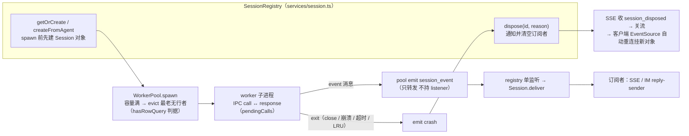

# pi-agent-server worker-pool

> Worker Pool 架构。master 通过 `child_process.spawn` 管理 N 个 worker 子进程。
> v2：LRU + MAX_WORKERS。**进程域 only**：领域状态（hasRow/model/…）归 Session；pool 只管 spawn/kill/IPC/事件转发，placeholder 判据经注入回调。

## 进程模型

- **每个 session 一个 worker**（决策 20 已定）
- worker 进程内只跑一个 `AgentSession` 实例
- worker 生命周期跟 session 生命周期绑定

```
master (Node.js)
 ├─ worker-A (child_process)  ← session-A（active 或 placeholder）
 ├─ worker-B (child_process)  ← session-B
 └─ worker-N (child_process)  ← session-N
```

## 启动策略：开 tab 即 spawn（v2）

v1 是"懒 spawn"——只有第一条 prompt 到达时才创建 worker。**v2 改为开 tab 即 spawn**，目的是让 slash menu 立即显示 prompts/skills/extensions（来自 `.pi/prompts/*.md`、`.pi/skills/*/SKILL.md`、pi extensions）。

```
[客户端调 POST /api/sessions/agents/:agentId]
  ↓
master: 生成 sessionId + spawn placeholder worker + createAgentSession（不写 sessions 表）
  ↓
worker: createAgentSession({ cwd: workspacePath }) ← 扫 cwd `.pi/` + 加载 packages
  ↓
worker: 返 { sessionHandle, piSessionPath, model }
  ↓
master: 调 listCommands + listAvailableModels → 返 commands[] + models[] 给客户端
  ↓
[5 分钟内未发第一条消息]
  ↓
scanner: kill placeholder worker（hasRow=false）
  ↓
[客户端发 POST /api/sessions/:id/prompt]
  ↓
master: sessionRegistry().getOrCreate → INSERT sessions + Session.hasRow = true
  ↓
[继续 prompt / steer / followUp]
  ↓
[事件流] Session.subscribe → pool emit('session_event') → Session 分发 → SSE → 客户端
         （`session_info_changed` 由 master 内部消费写 sessions.title，不进 SSE；
          worker 死 → registry.dispose → SSE 收 `session_disposed` 关流重连）

[用户/IDE 关 tab 或 master 退出]
  ↓
master: worker.dispose() → worker 进程退出（**sessions row 保留**，status 字段不变）
```

## WorkerEntry（只含进程事实）

```typescript
export interface WorkerEntry {
  sessionId: string;
  child: ChildProcess;
  workerPid: number;
  stderrTail: string[];
  ready: boolean;
  spawnTime: number;
  readyTimer: NodeJS.Timeout | null;
  pendingCalls: Map<...>;
  // 领域状态（hasRow / model / thinkingLevel / sessionName /
  // systemPrompt / piSessionPath / agentId）已迁移到 Session
  // （services/session.ts）——WorkerEntry 不再持有任何领域字段
}
```

**关键不变量**：
- `spawnTime` 在 `spawn()` 设一次（用于 placeholder timeout + LRU）
- **是否 placeholder 由注入回调回答**：`workerPool.setHasRowQuery(fn)` 在 `initSessionRegistry` 接线，回源 `Session.hasRow`——pool 不 import Session（依赖方向保持 Session → pool）
- `hasRow=false`（placeholder）的 worker：
  - 走 `placeholderTimeoutMs`（默认 5 分钟）超时被 scanner 杀
  - 可被 LRU 回收（worker pool 满时）
- `hasRow=true` 的 worker：
  - **不**被 scanner 自动杀（生命周期完全由调用方管理）
  - **不**被 LRU 回收

## Worker Pool 上限 + LRU 回收（v2 新增）

```typescript
class WorkerPool {
  private maxWorkers: number;  // 默认 20，从 config 读
  private workers = new Map<string, WorkerEntry>();

  async spawn(sessionId: string, workspacePath?: string): Promise<WorkerEntry> {
    if (this.workers.has(sessionId)) {
      throw new Error(`worker already exists for session ${sessionId}`);
    }

    if (this.workers.size >= this.maxWorkers) {
      const evicted = await this.evictOldestPlaceholder();
      if (!evicted) {
        throw new Error('No placeholder worker available to evict; all sessions active');
      }
    }
    // ... 原有 spawn 逻辑
  }

  private async evictOldestPlaceholder(): Promise<string | null> {
    let oldestId: string | null = null;
    let oldestTime = Infinity;
    for (const [id, e] of this.workers) {
      if (!this.hasRowQuery(id) && e.spawnTime < oldestTime) {  // 注入回调，回源 Session.hasRow
        oldestTime = e.spawnTime;
        oldestId = id;
      }
    }
    if (oldestId === null) return null;
    await this.kill(oldestId, 'lru-eviction');
    return oldestId;
  }

  setHasRowQuery(fn: (sessionId: string) => boolean): void {
    this.hasRowQuery = fn;   // initSessionRegistry 接线：id => Session.hasRow
  }
}
```

**回收顺序**：LRU 按 `spawnTime` 升序找最早 `hasRow=false` placeholder worker → kill → 释放槽位 → 新 spawn 继续。

**全 active 时**：抛 `Error('No placeholder worker available to evict; all sessions active')`。调用方（`POST /agents/:agentId` 路由）返 503 `capacity_exceeded`。

**配置**：
- env `MAX_WORKERS`（默认 20）
- env `PLACEHOLDER_TIMEOUT_MINUTES`（默认 5）

## master 端 WorkerPool

```typescript
class WorkerPool {
  // 进程内 Map（不写 DB）
  private workers = new Map<sessionId, WorkerEntry>();

  has(sessionId: string): boolean {
    return this.workers.has(sessionId);
  }

  async spawn(sessionId: string, workspacePath?: string): Promise<WorkerEntry> {
    // ... 上面的 LRU 逻辑
    // 原有 spawn：fork child_process + ready detection
  }

  async kill(sessionId: string, reason?: string): Promise<void> {
    // SIGTERM → 5s → SIGKILL
  }

  list(): Array<{ sessionId, workerPid, hasRow, spawnTime, ... }> {
    // scanner 用 snapshot 迭代（避免迭代中修改 map）
  }
}
```

## 反向调用（Worker → Master RPC）

Worker 可通过 `callMaster(method, args)` 回调 master。WorkerPool 在 `wireUpHandlers` 中监听 `reverse-call` 消息，分发到 `registerReverseCallHandler()` 注册的 handler。

```typescript
// 注册 handler（sendFileToUser 在 IM gateway 初始化时注册；
// invokeCapability（agent 管理 server 能力）由控制面在组合根 index.ts 启动时统一注册）
workerPool.registerReverseCallHandler('sendFileToUser', async (sessionId, args) => {
  const meta = getSessionMeta(sessionId);
  if (!meta) return { ok: true }; // IDE/Web session — no-op
  const adapter = getAdapter(meta.channelType, meta.channelId);
  // ... adapter.sendFile() / adapter.sendImage()
});
```

Worker 端：`callMaster()` 发送 `ReverseCallRequest`，await `ReverseCallResponse`（30s 超时）。

## 事件转发与订阅（2026-09-30 反转）

pool **不再持 listener**（旧的 `subscribe()` / `pendingListeners` 缓冲 / tryAttach 定时器 / 死亡转移机制已删除）：

```typescript
// wireUpHandlers 的 message 分支：只转发
this.emit('session_event', sessionId, event);   // SessionRegistry 单监听 → 分发给 Session.deliver

// exit 分支：emit('crash') → registry.dispose(sessionId, 'worker-death')
//            → 通知并清空订阅者 → SSE 写 session_disposed 并关流（客户端自动重连）
```

- Session 对象在 spawn **前**创建（对象保证覆盖 worker 存活期），listener 住对象上——预订阅事件无需缓冲
- registry 只挂**一个** `session_event` 监听（避免 EventEmitter maxListeners 告警）



## 关键边界

| 谁负责 | |
|---|---|
| **master** | spawn / IPC / 路由 / 超时扫描 / 反向调用分发（进程域）|
| **Session（services/session）** | 领域状态 / 事件订阅分发 / dispose 终态通知 / 领域命令执行 |
| **worker** | pi SDK 调用 / 事件产生 / 历史管理 / 默认工具（sendFileToUser 等） |
| **不存在的边界** | "worker 状态"持久化到 DB；pool 持领域字段或 listener |

## 崩溃处理

worker 崩溃后**不自动重启**。处理流程：

```
[worker 崩溃]
  ↓
master: worker.on('exit', code) 事件触发
  ↓
master: 从 Map 删除 workerId / sessionId
  ↓
registry.dispose(sessionId, 'worker-death')（事件经 'crash' 触发：通知并清空订阅者，SSE 关流重连）
  ↓
master: sessions.status = 'archived'（不区分超时 / 崩溃）
  ↓
[用户消息到达 archived session]
  ↓
master: spawn 新 worker + createAgentSession({ sessionId })
  ↓
pi SDK: 从 ~/.pi/agent/sessions/<id>/ 加载历史
  ↓
session: status → active
```

**为什么不自动重启**：
- 避免状态错乱（worker 内部可能处于不一致状态）
- 不浪费资源（user 不一定回来）
- 用户消息触发恢复是惰性的、自然的

## Worker 进程管理细节

从 `pi-server-main/pi-process.ts` 借鉴的 3 个模式（不抄代码，思路自己重写）。

### worker 进程 cwd = agent workspacePath

**为什么**：第三方 pi 插件可能直接读 `process.cwd()`（不通过 pi SDK session cwd）。如果 worker cwd = master 启动目录，插件拿错目录。

**实现**：`WorkerPool.spawn(sessionId, workspacePath?)` 接受 agent workspacePath：

```typescript
const child = spawn(process.execPath, nodeArgs, {
  cwd: workspacePath ?? process.cwd(),  // 优先 agent workspacePath
  // ...
});
```

**调用方**：`services/session.ts` 的私有 spawn 实现（经 `sessionRegistry()`）传 `agent.workspacePath`。

**为什么不影响模块解析**：
- 入口文件 `WORKER_ENTRY` 是绝对路径（master 解析时用 `path.resolve`）
- 相对 import 基于文件位置，不依赖 cwd
- 包 import 向上找 `node_modules/`，不依赖 cwd
- `__dirname` / `__filename` 基于文件位置

**前提**：调用方必须传 `workspacePath`（`agent.workspacePath` 来自 `agentRepo.get(id)`，是 normalize 后的绝对路径）。若路径不存在，prompt API 入口校验直接 400（不触发 spawn ENOENT）。

### 启动快速失败（200ms 检测）

```typescript
// master: spawn worker 后立刻检测启动错误
const worker = fork('./workers/session-worker/dist/index.js');

await new Promise<void>((resolve, reject) => {
  const timer = setTimeout(resolve, 200); // 200ms 内不报错 = 启动成功
  
  worker.once('error', (err) => {
    clearTimeout(timer);
    reject(new Error(`Failed to start worker: ${err.message}`));
  });
  
  worker.once('exit', (code) => {
    if (code !== null && code !== 0) {
      clearTimeout(timer);
      reject(new Error(`Worker exited immediately with code ${code}`));
    }
  });
});
```

**为什么 200ms**：
- 启动失败（找不到 worker 脚本 / 立即崩）通常 <100ms 就退出
- 正常启动需要更长时间（createAgentSession 等 SDK 初始化）
- 200ms 是折中：太快会误报，太慢上层等待过久

### stderr 诊断收集 + 主时间线 tee

worker 的日志约定（见 [`pi-agent-server_logging.md`](pi-agent-server_logging.md)）：pino JSON 行写 **stderr**。master 端对 stderr 做两件事：

1. **tee 到主时间线**：按行解析 —— JSON 行按原级别重打到 master logger（补 `sessionId` / `workerPid` 字段），非 JSON 行（栈迹 / SDK 输出）落 `raw` 字段 @info
2. **保留 stderrTail**：最近 100 chunks FIFO，供 `GET /debug/sessions/:id`

```typescript
entry.child.stderr.on('data', (chunk) => {
  entry.stderrTail.push(chunk.toString());   // debug 端点用（100 chunks FIFO）
  lineBuf += chunk.toString();
  // 逐行：JSON.parse → logger[level](fields + {sessionId, workerPid}, msg)；
  //       失败 → logger.info({ raw: line }, 'worker stderr')
});
```

**用途**：worker 启动失败 / 运行时异常的错误信息同时进主日志（可 grep）和 stderrTail（debug 端点即时可见）。

### 优雅停止（SIGTERM → 5s → SIGKILL）

```typescript
async dispose(sessionId: string): Promise<void> {
  const workerId = this.workerBySession.get(sessionId);
  if (!workerId) return;
  
  const worker = this.workers.get(workerId);
  if (!worker) return;
  
  return new Promise<void>((resolve) => {
    const timeout = setTimeout(() => {
      // 5s 后还没退出，强制 kill
      worker.kill('SIGKILL');
      resolve();
    }, 5000);
    
    worker.once('exit', () => {
      clearTimeout(timeout);
      resolve();
    });
    
    // 通知 worker 走 dispose 流程
    worker.send({ kind: 'call', method: 'dispose' });
    // 同时发 SIGTERM（worker 不响应 dispose 时兜底）
    worker.kill('SIGTERM');
  });
}
```

**为什么 5 秒**：
- 给 pi SDK 清理时间（写历史文件、关闭连接）
- 太短可能数据丢失
- 太长 user 等得不耐烦

## 待决

- **数量策略**（决策 20 待决问题 1）：固定 N / 动态 / 无限制 — 暂时不定

## 相关文档

- [`pi-agent-server_ipc.md`](pi-agent-server_ipc.md) —— IPC 协议（master ↔ worker）
- [`pi-agent-server_logging.md`](pi-agent-server_logging.md) —— 日志（worker stderr tee 进主时间线）
- [`pi-agent-server_session-lifecycle.md`](pi-agent-server_session-lifecycle.md) —— session 生命周期